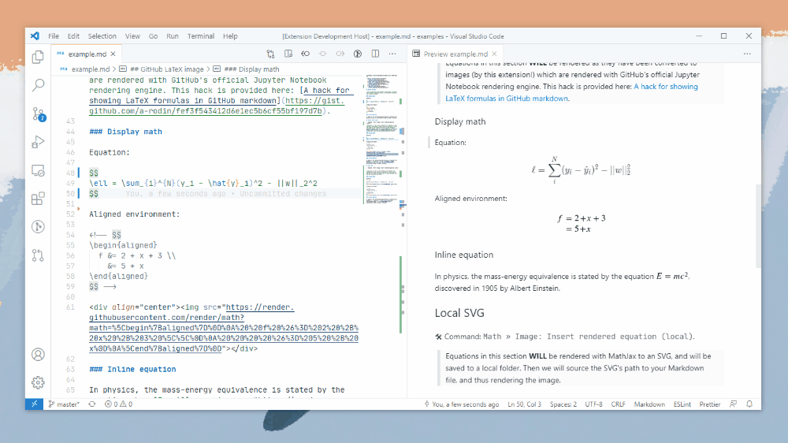

<div align="center">


<h1>Math » Image</h1>

📐 <em>We can help you render LaTeX math equations in any Markdown file! </em>

[](https://dev.azure.com/MeowTeam/vscode-math-to-image/_build/latest?definitionId=1&branchName=master)
[](https://marketplace.visualstudio.com/items?itemName=MeowTeam.vscode-math-to-image)


<!--  -->

</div>

This is a VS Code extension to help you convert a standard LaTeX math equation like `$E=mc^2$` to an image like  (remote) or a local SVG which can be embedded inside Markdown files or websites that doesn't support rendering LaTeX yet. ~~(That's you GitHub!)~~

<h2>Table of Contents</h2>

- [Demo](#demo)
- [Features](#features)
  - [Rendering remotely](#rendering-remotely)
  - [Rendering locally](#rendering-locally)
- [Extension Settings](#extension-settings)
- [Change Log](#change-log)

## Demo



## Features

There are two modes in which we will render your math equations in Markdown:

* Locally (with MathJax and sourcing relative SVG), and...
* Remotely (with GitHub's LaTeX rendering server).

### Rendering remotely

This is actually a hack. GitHub won't render LaTeX equations inside normal places like GitHub README, but it can render them in Jupyter notebooks, so we took advantage of this feature, utilizing GitHub's equation rendering server to embed SVG equations in GitHub. (See here for details: [A hack for showing LaTeX formulas in GitHub markdown](https://gist.github.com/a-rodin/fef3f543412d6e1ec5b6cf55bf197d7b).)

Basically we can convert a standard LaTeX math equation like the *Gaussian Normal Distribution*...

```latex
$$
P(x) = \frac{1}{\sigma\sqrt{2\pi}} e^{\frac{-(x-\mu)^2}{2\sigma^2}}
$$
```

... to a rendered image tag with the help of GitHub's math rendering server:

```html
<div align="center"></div>
```

<div align="center"></div>

### Rendering locally

Not everywhere accept external SVGs. To circumvent this type of scenario, we can render math equations directly to local SVGs (with MathJax), and embed these local SVGs into our Markdown as a workaround.

We can convert the same LaTeX math equation:

```latex
$$
P(x) = \frac{1}{\sigma\sqrt{2\pi}} e^{\frac{-(x-\mu)^2}{2\sigma^2}}
$$
```

To a local SVG like: `svg/e40qQ5G9jw.svg`, which will be saved to a dedicate folder called `svg`, and sourced inside the Markdown file that requires math-embedding.

> 🌸 NOTE: There used to be a demo SVG here, but Visual Studio Marketplace won't allow us to add local SVGs inside their README.

If you are reading this on GitHub, you can see that both of these methods work when we need to add math equations to READMEs or other Markdown files on GitHub.

See [examples](examples/example.md) for more math equation rendering scenarios, i.e, inline math, aligned environments...

## Extension Settings

You can specify the path to save the locally rendered SVG image. The settings are self-explanatory.

* **vscode-math-to-image.svgSavePath**:
  * `Current file directory`: Generated SVG files will be put in a folder under current file's directory.
  * `Current workspace directory`: Generated SVG files will be put in a folder under current workspace directory.

## Change Log

For version updates and bug fixes, please see: [CHANGELOG](CHANGELOG.md).

---

📐 **Math » Image** © TeamMeow. Released under the MIT License.

Authored and maintained by TeamMeow members.

> 🦁 We build things that go "meow" · [@GitHub](https://github.com/TeamMeow) · [@Members](https://github.com/orgs/TeamMeow/people?type=source)
